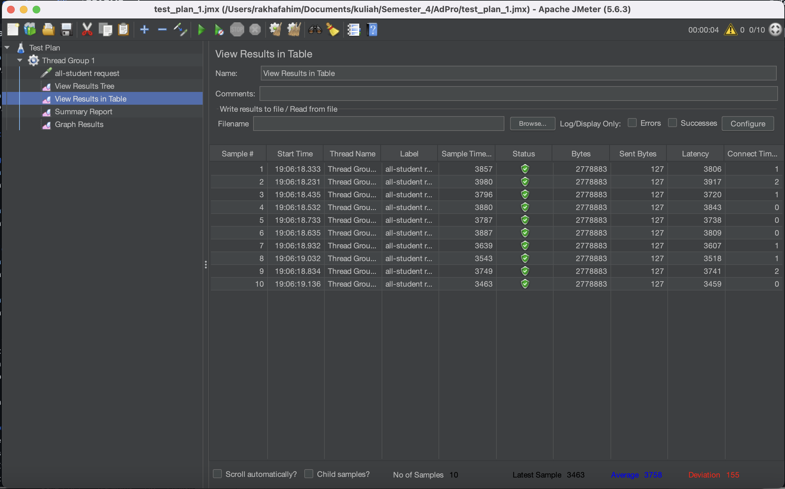
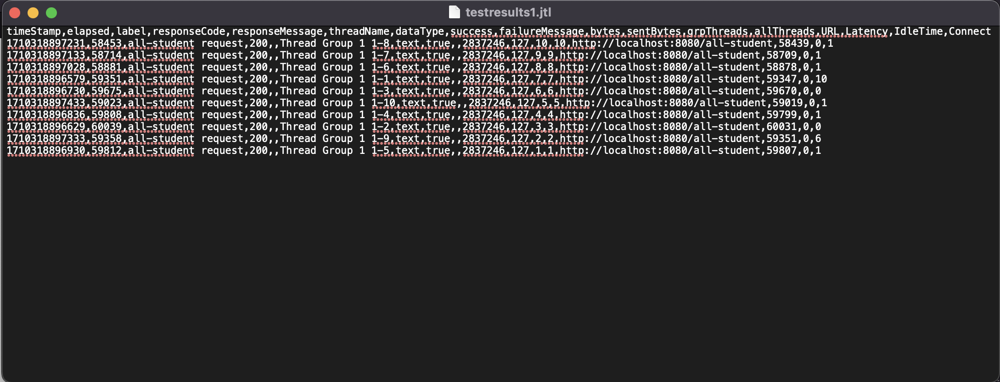
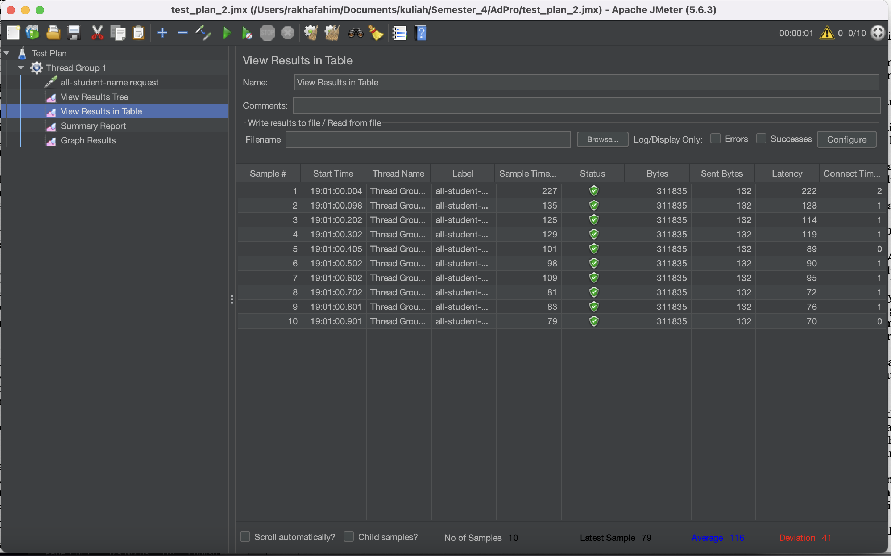
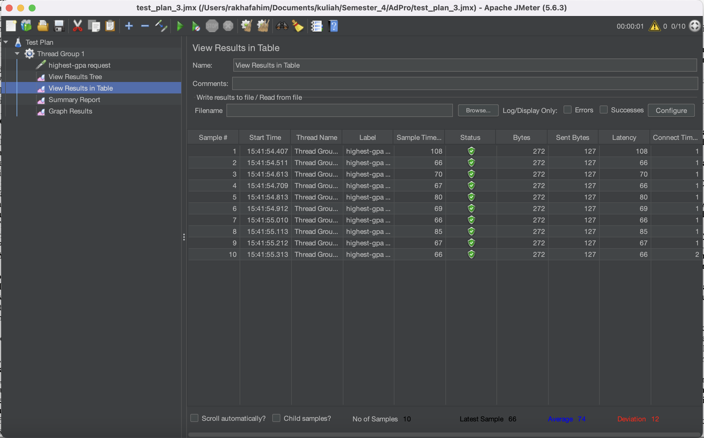

# Lab 05
## Screenshots

### /all-student

### /all-student-name

### /highest-gpa

**Improvement from JMeter Measurements:**

JMeter measurements provide quantitative data on performance changes after optimizations, indicating whether response times decrease or throughput increases.

## Reflection
1. **Difference between Performance Testing with JMeter and Profiling with IntelliJ Profiler:**

   JMeter focuses on simulating user load and measuring response times, while IntelliJ Profiler analyzes code execution at a granular level, identifying specific performance bottlenecks.

2. **How Profiling Helps Identify Weak Points:**

   Profiling reveals CPU and memory usage, method execution times, and thread activity, pinpointing areas of inefficiency or resource contention in the application code.

3. **Effectiveness of IntelliJ Profiler:**

   IntelliJ Profiler is effective in analyzing and identifying bottlenecks by providing detailed insights into code execution behavior and resource utilization.

4. **Challenges in Performance Testing and Profiling:**

   Challenges include the complexity of large applications, differences in environments affecting testing results, and resource constraints limiting testing accuracy.

5. **Benefits of Using IntelliJ Profiler:**

   IntelliJ Profiler offers insights into runtime behavior, aids in optimizing resource usage, and validates optimization efforts through before-and-after performance comparisons.

6. **Handling Inconsistent Results from Profiling:**

   Cross-reference results from JMeter and IntelliJ Profiler, focusing on areas of convergence to prioritize optimization efforts effectively.

7. **Optimizing Application Code after Testing and Profiling:**

   Strategies include identifying hotspots, refactoring code for efficiency, implementing caching mechanisms, and continuously monitoring performance metrics to iteratively improve performance without compromising functionality.